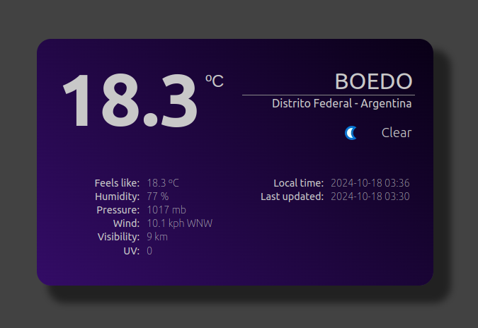
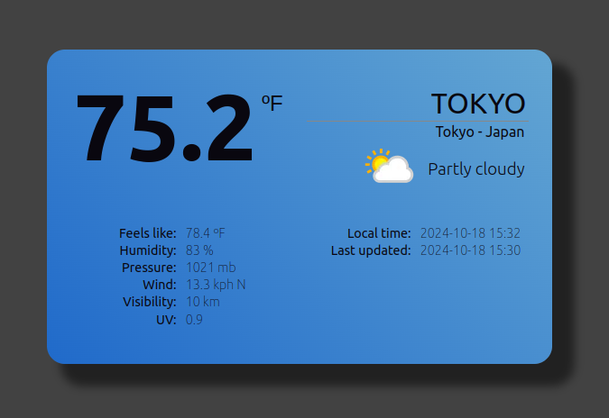

# Simple Weather App with create-svelte

Its using the [WeatherAPI](https://www.weatherapi.com/) from [RapidAPI](https://rapidapi.com/hub). Create an account and get your API key. Then create a `.env` file with the following:

```bash
RAPID_API_KEY=
RAPID_API_HOST=
```

## Live

- [https://weather-app-apuerta.vercel.app](https://weather-app-apuerta.vercel.app)

## Features

- Day/Night theme
- Input for city name (press enter)
- Temperature in Celsius/Fahrenheit (click the unit button to toggle)
- Feels like in Celsius/Fahrenheit too
- Humidity
- Pressure
- Wind in kph with direction
- Visibility in kilometers
- UV

## Snapshots




## Original create-svelte instructions

Everything you need to build a Svelte project, powered by [`create-svelte`](https://github.com/sveltejs/kit/tree/main/packages/create-svelte).

### Creating a project

If you're seeing this, you've probably already done this step. Congrats!

```bash
# create a new project in the current directory
npm create svelte@latest

# create a new project in my-app
npm create svelte@latest my-app
```

### Developing

Once you've created a project and installed dependencies with `npm install` (or `pnpm install` or `yarn`), start a development server:

```bash
npm run dev

# or start the server and open the app in a new browser tab
npm run dev -- --open
```

### Building

To create a production version of your app:

```bash
npm run build
```

You can preview the production build with `npm run preview`.

> To deploy your app, you may need to install an [adapter](https://kit.svelte.dev/docs/adapters) for your target environment.
